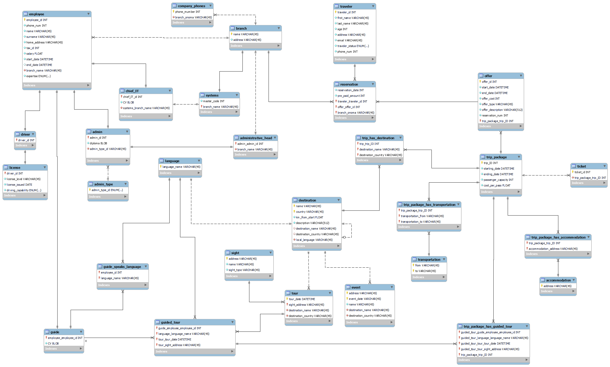

## Travel Agency Database
This is a database system designed manage the travel-related information for a travel agency called *Pausanias*, created for the purposes of the [Design and Use of Database Systems](https://www.di.uoa.gr/en/studies/undergraduate/27) course. This database system allows the company to store, update, and retrieve information, enabling the delivery of services to their customers. Each table represents a specific entity within the travel agency ecosystem, with well-defined relationships and attributes that capture relevant details. The assignments can be viewed over at the `assignments` folder (*note* they're in greek).

### [Assignment 1: Database Schema Implementation](https://github.com/pavlosdais/Travel-Agency-Database/tree/main/hw1)
In the first assignment, we focused on implementing the database schema for the travel agency. Using [MySQL Workbench](https://www.mysql.com/products/workbench/), we created a diagram that represents the structure of the database providing a visual representation of it. The schema includes several tables, such as employees, traveler, tour, package, and offer. Each table has its own set of attributes that capture relevant information for the travel agency's needs. Implementing the schema involved defining the relationships between the tables, establishing primary and foreign key constraints, and ensuring the data model accurately represents the requirements of the company as provided by the assignment.

  
Click here to view the schema

   
  

**Score: 95/100**

### [Assignment 2: Queries and Python Interface](https://github.com/pavlosdais/Travel-Agency-Database/tree/main/hw2)
In this assignment, we were given an already implemented database of the travel agency using a given schema.

**Part A: Queries**

The task was to write mySQL queries to extract valuable information from the database. These queries allow the retrieval of data related to employees, travelers, destinations, trip packages, reservations, and more. View the queries we wrote [here](https://github.com/pavlosdais/Travel-Agency-Database/tree/main/hw2#readme).

**Part B: Python Interface**

In the second assignment's Part B, we built a Python [interface](https://github.com/pavlosdais/Travel-Agency-Database/tree/main/hw2/application) to interact with the travel agency database. The interface provides a user-friendly way to run queries and retrieve information without directly working with SQL. Using given a database connector library, we developed a set of functions that encapsulate the queries. This allows users to interactively perform database operations.

**Score: Unknown**

## Authors
* [Pavlos Dais](https://github.com/pavlosdais)
* [Aristarhos Kaloutsas](https://github.com/aristarhoskal)
* [Themis Marinaki](https://github.com/marinakithemis)
