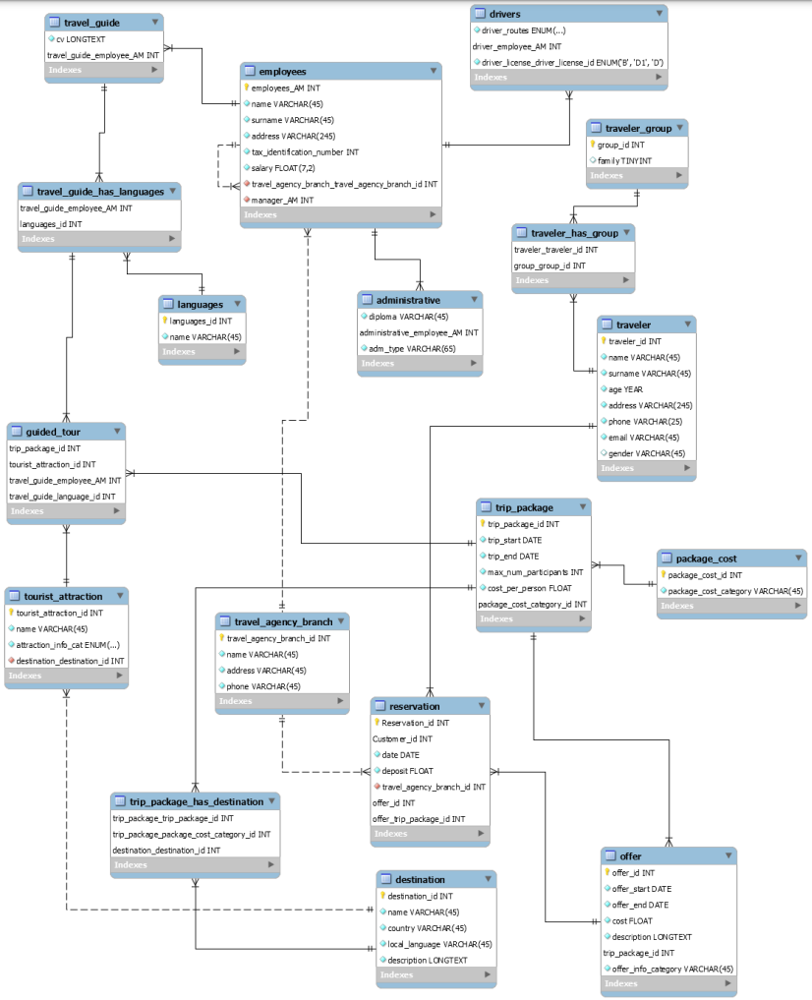

# Database
The database we were given can be viewed at the `database` folder.

  
Click here to view the given schema

   
  

## Part A
[1.](https://github.com/pavlosdais/Travel-Agency-Database/blob/main/hw2/queries.sql#L1) Find the names of the tour guides that have been used by the agency for destinations in Germany.

[2.](https://github.com/pavlosdais/Travel-Agency-Database/blob/main/hw2/queries.sql#L11) Find the ID's of the tour guides with more than 3 tours in the year 2019.

[3.](https://github.com/pavlosdais/Travel-Agency-Database/blob/main/hw2/queries.sql#L31) Find the number of employees for each branch of the travel agency.

[4.](https://github.com/pavlosdais/Travel-Agency-Database/blob/main/hw2/queries.sql#L38) Find the travel packages and the number of reservations made for them within the period '2021-01-01' to '2021-12-31' with the destination as Paris.

[5.](https://github.com/pavlosdais/Travel-Agency-Database/blob/main/hw2/queries.sql#L49) Find the tour guides who have conducted all tours in the same language.

[6.](https://github.com/pavlosdais/Travel-Agency-Database/blob/main/hw2/queries.sql#L62) Check if there was an offer from the travel agency that was not used by anyone. The query should return the value "yes" or "no".

[7.](https://github.com/pavlosdais/Travel-Agency-Database/blob/main/hw2/queries.sql#L82) Find all male travelers who are aged 40 and above and have made reservations for more than 3 travel packages.

[8.](https://github.com/pavlosdais/Travel-Agency-Database/blob/main/hw2/queries.sql#L94) Find the names of the tour guides who speak English and the number of tourist attractions that have been visited during tours by them.

[9.](https://github.com/pavlosdais/Travel-Agency-Database/blob/main/hw2/queries.sql#L116) Find the country of the destination that is included in the most travel packages.

[10.](https://github.com/pavlosdais/Travel-Agency-Database/blob/main/hw2/queries.sql#L129) Find the codes of the travel packages that include all the travel destinations related to Ireland.

**Extra**

[11.](https://github.com/pavlosdais/Travel-Agency-Database/blob/main/hw2/queries.sql#L145) Find the names of the tour guides that have been used by the agency for *all* destinations in Germany.

## Part B
[1.](https://github.com/pavlosdais/Travel-Agency-Database/blob/main/hw2/application/app.py#L19) Given the argument of a branch code and two dates, for the trips organized by the branch with the given code, and whose departure date is within the specified date range, the following information will be returned:
* Trip cost per person.
* Maximum number of participants.
* Total number of reservations.
* Available spots.
* Last and first name of the driver.
* Last and first name of the tour guide (e.g., 'Leuschke Antonia').
* Departure and return dates.

[2.](https://github.com/pavlosdais/Travel-Agency-Database/blob/main/hw2/application/app.py#L223) Given the argument of either the word "ASC" or the word "DESC", a list will be generated for all the branches in ascending or descending order, respectively, based on their total revenues. In other words, the branch with the highest revenue will be displayed first if "DESC" is selected, or last if "ASC" is selected. The following information will be shown for each branch: branch code, total number of reservations, total revenues (reservation count multiplied by trip cost per person), total number of employees, and the total amount of salaries paid for its employees.

[3.](https://github.com/pavlosdais/Travel-Agency-Database/blob/main/hw2/application/app.py#L305) Who is the customer with the highest revenue, how many different cities and countries have they visited, and what attractions have they visited? The argument "BEST" is given. The following information will be displayed: the customer's first name and last name, the number of countries visited, the number of cities visited, and a list of the attractions visited.

[4.](https://github.com/pavlosdais/Travel-Agency-Database/blob/main/hw2/application/app.py#L443) Every year, the agency donates N "personalized" trips by randomly selecting N clients (travelers) - N is given as an argument. For these clients, the agency will propose a travel package to a destination they haven't visited in the past. Once the clients are selected, the destinations are chosen, and the costs are calculated, these travel offers ought to be inserted into the database. After successfully inserting into the database, the lucky clients and information about their package will be printed as a string.
